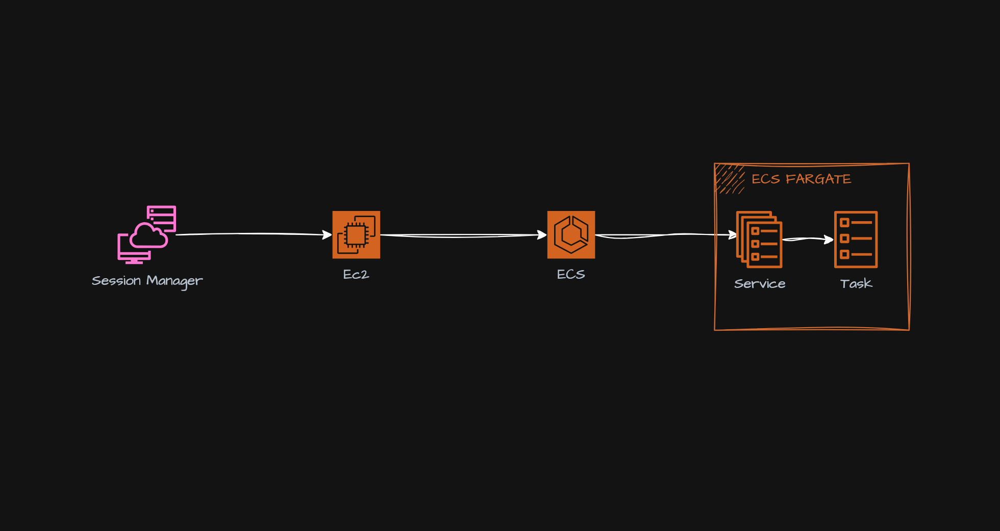

# aws-ecs-fargate-connect

The aws-ecs-fargate-connect project provides a solution for connecting to Amazon Elastic Container Service (ECS) Fargate tasks. It allows developers to establish an interactive session with a running container within an ECS Fargate task, enabling debugging, troubleshooting, and maintenance operations.

## Architecture



## System Requirements

- **Runtime Environment**: This project is designed to run on Amazon Web Services (AWS) infrastructure and requires the following services:

  - Amazon Elastic Compute Cloud (EC2)
  - Amazon Elastic Container Service (ECS)
  - Amazon Identity and Access Management (IAM)
  - Amazon Virtual Private Cloud (VPC)

- **System Dependencies**:

  - Terraform (version 0.14 or later)
  - AWS Command Line Interface (AWS CLI)

- **Required Services**:

  - An existing VPC and subnet within the desired AWS region
  - An existing ECS cluster with running Fargate tasks

- **Network Requirements**:
  - Inbound and outbound network access to the AWS services mentioned above

## Quick Start

```bash
# Installation
# Install Terraform and AWS CLI on your local machine or development environment.

# Configuration
# 1. Clone the aws-ecs-fargate-connect repository.
# 2. Navigate to the `environment` directory and update the `variables.tf` file with your AWS account details, VPC ID, subnet ID, and ECS cluster name.

# Run Terraform
terraform init
terraform apply
```

This will provision an EC2 instance with the necessary IAM permissions and security group configurations to connect to your ECS Fargate tasks.

```bash
# Connect to the EC2 Instance
# Use the AWS Systems Manager Session Manager to connect to the provisioned EC2 instance.

# Execute the Connection Script
cd /home
./ecs_connect.sh <service_name>
```

Replace `<service_name>` with the name of the service you want to connect to.

## Architecture Overview

The aws-ecs-fargate-connect project follows a modular architecture, leveraging Terraform modules to provision the necessary AWS resources. The main components are:

1. **EC2 Instance**: An Amazon EC2 instance is provisioned with the required IAM permissions and security group configurations to access the ECS cluster and Fargate tasks.

2. **IAM Role and Policies**: An IAM role with the necessary permissions is created and attached to the EC2 instance. This role allows the instance to interact with ECS, Systems Manager, and other required AWS services.

3. **Security Group**: A security group is created to control inbound and outbound traffic to the EC2 instance.

4. **User Data Script**: A user data script is executed during the EC2 instance launch, which installs the required dependencies (AWS CLI and Session Manager plugin) and creates a script (`ecs_connect.sh`) for establishing the interactive session with the Fargate task.

The data flow between components is as follows:

1. The developer runs the Terraform code, which provisions the EC2 instance and associated resources.
2. The developer connects to the EC2 instance using the AWS Systems Manager Session Manager.
3. The developer executes the `ecs_connect.sh` script, providing the container name and ECS cluster name (if different from the default).
4. The script uses the AWS CLI to retrieve the task ARN for the specified service and container.
5. The script initiates an interactive session with the container using the `aws ecs execute-command` command.

## Core Components

### EC2 Instance

- **Purpose**: The EC2 instance serves as a bastion host for connecting to the ECS Fargate tasks. It is provisioned with the necessary IAM permissions and security group configurations to access the ECS cluster and Fargate tasks.

- **Key Resources**:

  - `aws_spot_instance_request`: Provisions an EC2 instance using an AWS Spot Instance request.
  - `aws_security_group`: Configures the security group rules for the EC2 instance.
  - `aws_iam_role`: Creates an IAM role with the required permissions for interacting with ECS, Systems Manager, and other AWS services.
  - `aws_iam_instance_profile`: Associates the IAM role with the EC2 instance.

- **Configuration Options**:
  - EC2 instance configuration (AMI, instance type, spot price, volume size, volume type, termination protection)
  - Security group rules (inbound and outbound traffic rules)
  - IAM role permissions

```python
# Example usage in Terraform code
module "ec2" {
  source           = "../modules/ec2"
  ec2_config       = var.ec2_config
  environment      = var.environment
  key              = var.key
  bucket           = var.bucket
  region           = var.region
  vpc_id           = var.vpc_id
  subnet_id        = var.subnet_id
  ecs_cluster_name = var.ecs_cluster_name
}
```

### User Data Script

- **Purpose**: The user data script is executed during the EC2 instance launch. It installs the required dependencies (AWS CLI and Session Manager plugin) and creates a script (`ecs_connect.sh`) for establishing the interactive session with the Fargate task.

- **Key Components**:
  - Installation of AWS CLI and Session Manager plugin
  - Creation of the `ecs_connect.sh` script

```bash
# Example usage of the ecs_connect.sh script
./ecs_connect.sh <service_name>
```

## Configuration

| Variable           | Description                                                  | Required | Default | Example                                                             |
| ------------------ | ------------------------------------------------------------ | -------- | ------- | ------------------------------------------------------------------- |
| `ec2_config`       | A map of EC2 instance configuration options                  | Yes      | N/A     | `{ ami = "ami-0123456789abcdef", instance_type = "t3.micro", ... }` |
| `environment`      | The environment name (e.g., dev, staging, prod)              | Yes      | N/A     | `"dev"`                                                             |
| `key`              | The SSH key pair name for the EC2 instance                   | Yes      | N/A     | `"my-key-pair"`                                                     |
| `bucket`           | The S3 bucket name for Terraform state storage               | Yes      | N/A     | `"my-terraform-state-bucket"`                                       |
| `region`           | The AWS region where resources will be provisioned           | Yes      | N/A     | `"us-east-1"`                                                       |
| `account_id`       | The AWS account ID where resources will be provisioned       | Yes      | N/A     | `"123456789012"`                                                    |
| `ecs_cluster_name` | The name of the ECS cluster containing the Fargate tasks     | Yes      | N/A     | `"my-ecs-cluster"`                                                  |
| `vpc_id`           | The ID of the VPC where resources will be provisioned        | Yes      | N/A     | `"vpc-0123456789abcdef"`                                            |
| `subnet_id`        | The ID of the subnet where the EC2 instance will be launched | Yes      | N/A     | `"subnet-0123456789abcdef"`                                         |

## Error Handling

- **Common Error Scenarios**:

  - Insufficient IAM permissions: If the EC2 instance does not have the required permissions to interact with ECS, Systems Manager, or other AWS services, errors will occur during the connection process.
  - Network connectivity issues: If the EC2 instance cannot communicate with the ECS cluster or Fargate tasks due to network or security group configurations, errors will occur during the connection process.
  - Invalid container or cluster name: If the provided container or cluster name is incorrect, the script will fail to retrieve the task ARN or establish the interactive session.

- **Error Response Formats**:

  - AWS CLI errors: The AWS CLI will display error messages and exit codes when encountering issues during the connection process.
  - Script errors: The `ecs_connect.sh` script will print error messages to the console if any issues occur during the execution.

- **Troubleshooting Steps**:

  1. Verify the IAM permissions associated with the EC2 instance and ensure they are correct.
  2. Check the security group rules and network configurations to ensure the EC2 instance can communicate with the required AWS services.
  3. Confirm the provided container and cluster names are correct.
  4. Review the AWS CloudTrail logs and ECS event logs for any relevant error messages or failures.

- **Logging and Monitoring**:
  - AWS CloudTrail: Enable CloudTrail logging to capture API calls made by the EC2 instance and identify any permission or configuration issues.
  - ECS Event Logs: Monitor the ECS event logs for any relevant errors or failures related to the Fargate tasks or cluster.
  - EC2 Instance Logs: Review the EC2 instance logs (e.g., user data script logs, AWS CLI logs) for any relevant error messages or failures.

## Development Guide

1. **Setup Development Environment**:

   - Install Terraform and AWS CLI on your local machine or development environment.
   - Configure the AWS CLI with your AWS credentials and desired region.

2. **Code Organization**:

   - The project follows a modular structure, with the main Terraform code located in the `environment` directory.
   - The `modules` directory contains reusable Terraform modules for provisioning EC2 instances, IAM roles, and security groups.

3. **Testing Approach**:

   - Use Terraform's `plan` command to preview the changes before applying them to your AWS environment.
   - Create separate Terraform workspaces or state files for different environments (e.g., dev, staging, prod) to isolate changes and resources.
   - Manually test the connection process by following the steps outlined in the Quick Start section.

4. **Deployment Process**:
   - Update the Terraform code with the desired configuration changes.
   - Run `terraform plan` to review the changes.
   - Run `terraform apply` to apply the changes and provision the necessary resources.
   - Connect to the provisioned EC2 instance and test the connection process.

## Security Considerations

- **Authentication Methods**:

  - The EC2 instance authenticates with AWS services using an IAM role with the required permissions.
  - The developer connects to the EC2 instance using the AWS Systems Manager Session Manager, which provides secure and auditable access.

- **Authorization Rules**:

  - The IAM role associated with the EC2 instance should follow the principle of least privilege, granting only the necessary permissions required for the connection process.
  - The security group rules should be configured to allow only the required inbound and outbound traffic.

- **Data Protection**:

  - No sensitive data is stored or transmitted by this project. However, it is recommended to follow AWS best practices for data protection, such as encrypting EBS volumes and using secure communication channels.

- **Security Best Practices**:
  - Regularly review and update the IAM permissions and security group rules to ensure they align with the principle of least privilege.
  - Enable AWS CloudTrail logging to monitor and audit API calls made by the EC2 instance.
  - Implement appropriate access controls and authentication mechanisms for connecting to the EC2 instance (e.g., SSH key pairs, bastion hosts, or VPN connections).
  - Regularly patch and update the EC2 instance and its dependencies to address security vulnerabilities.

## Limitations & Known Issues

- **Current Limitations**:

  - The project currently supports connecting to a single container within an ECS Fargate task. It does not provide functionality for connecting to multiple containers within the same task.
  - The connection process requires manual intervention by the developer to execute the `ecs_connect.sh` script on the EC2 instance.

- **Performance Considerations**:

  - The performance of the interactive session may be impacted by the network latency between the EC2 instance and the ECS cluster, as well as the available resources (CPU, memory) of the Fargate task.

- **Common Problems and Solutions**:
  - **Problem**: Unable to connect to the EC2 instance due to network or security group configurations.
    - **Solution**: Review the security group rules and network configurations to ensure the EC2 instance can communicate with the required AWS services and the developer's local machine or bastion host.
  - **Problem**: Insufficient IAM permissions to interact with ECS, Systems Manager, or other AWS services.
    - **Solution**: Review the IAM role associated with the EC2 instance and ensure it has the necessary permissions for the required actions.
